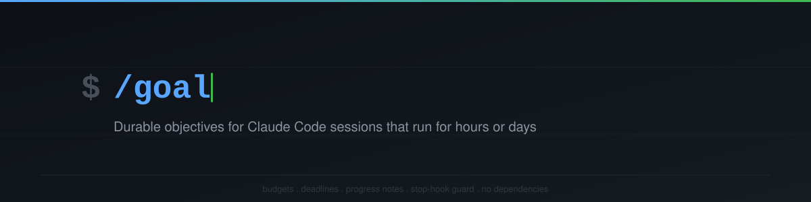

# /goal

[](https://github.com/bullish0x/goal-cc/actions/workflows/test.yml)
[](https://opensource.org/licenses/MIT)
[](https://github.com/bullish0x/goal-cc/releases)

> Give Claude Code a durable objective and it won't stop until the work is done.
> Budgets, deadlines, progress notes, idle detection, and a Stop-hook guard that
> keeps sessions alive across hours or days -- all in a single file with no
> dependencies.

A project slash command plus `Stop` hook for Claude Code that turns one durable
objective into a long-running, inspectable, resumable session. Built for runs
that may last hours or days without losing track.

```text
/goal [<subcommand>] [--tokens N] [--deadline D] [--json] <objective>
```

No runtime dependencies. The helper stays compatible with Node 12.22+ because
some Bash environments resolve `/usr/bin/node` to an older system Node. The
test suite uses `node:test`, so development and CI should use Node 18+.

## Install

### Claude Code plugin (recommended)

From Claude Code, run:

```text
/plugin marketplace add bullish0x/goal-cc
/plugin install goal@goal-cc
```

This installs the packaged plugin from `plugins/goal/`, including the `/goal`
command, helper script, and Stop hook. Restart Claude Code so everything loads.

For a project-shared install, use Claude Code's project scope:

```text
/plugin marketplace add bullish0x/goal-cc
/plugin install goal@goal-cc --scope project
```

If `marketplace add` prompts for a scope inside Claude Code, choose `project`.
As of 2026-05-09, the official non-interactive CLI also supports declaring the
marketplace at project scope:

```bash
claude plugin marketplace add https://github.com/bullish0x/goal-cc.git --scope project
claude plugin install goal@goal-cc --scope project
```

If you are testing a local checkout before publishing, run:

```bash
claude --plugin-dir ./plugins/goal
```

### Manual

Place this repository at the root of the project where you use Claude Code.
Claude Code reads project commands from `.claude/commands/` and the project
Stop hook from `.claude/settings.json`. Restart Claude Code so both load. The
Stop hook can be disabled by deleting the `Stop` entry from
`.claude/settings.json`.

If you already have a `.claude/settings.json` with other hooks, merge the
`"Stop"` entry into your existing file instead of replacing it.

### Heads-up for Windows users

The `.claude/` directory is the only thing that wires up the command, Stop
hook, and helper script. Some Windows copy flows and globs skip hidden or
dot-prefixed directories, so verify that `.claude\` came along or `npm test`
will fail with missing-file errors.

Before you copy, turn on hidden items so you can see `.claude\` and
`.gitignore`:

- File Explorer: View tab -> check **Hidden items**.
- PowerShell: `Get-ChildItem -Force` lists hidden and dot-prefixed entries
  reliably.

Then copy with a tool that preserves dotfiles. PowerShell handles them
correctly when you use `*` plus an explicit `.claude` pass:

```powershell
$src = "C:\path\to\source"
$dst = "C:\path\to\destination"
Copy-Item -LiteralPath "$src\*"       -Destination $dst -Recurse -Force
Copy-Item -LiteralPath "$src\.claude" -Destination $dst -Recurse -Force
```

Robocopy can mirror everything including hidden entries in one shot. Only use
`/MIR` when the destination is disposable or already meant to exactly match
the source, because it deletes destination files that are not present in the
source:

```powershell
robocopy C:\path\to\source C:\path\to\destination /MIR
```

After copying, verify the hidden directory landed:

```powershell
Test-Path .\.claude\commands\goal.md
Test-Path .\.claude\settings.json
Test-Path .\.claude\scripts\goal-helper.mjs
```

All three must print `True`. If any prints `False`, re-copy with hidden items
visible. Missing `.claude` causes `npm test` to fail because the command,
Stop hook, and helper script live there.

### Linux / Mac manual install

Clone or copy the repository into your project, then verify:

```bash
test -f .claude/commands/goal.md        && echo OK || echo MISSING
test -f .claude/settings.json           && echo OK || echo MISSING
test -f .claude/scripts/goal-helper.mjs && echo OK || echo MISSING
```

All three must print `OK`. If you cloned from GitHub, the `.claude` directory
is present by default (no hidden-file issues on Linux/Mac). Restart Claude Code
so the command and Stop hook load.

## Quick tour

Start a goal with a soft token budget and deadline, add a progress note,
check status, and complete when done:

```text
/goal --tokens 100K --deadline 2h Refactor the auth module to use the new token format

/goal note Split out token validation into its own helper; tests passing so far

/goal status

/goal complete
```

The Stop hook will keep the session alive while the goal is active. If the
agent hits a hard blocker or refusal, the goal auto-pauses instead of looping.
Paused goals resume with `/goal resume`. See status and history as JSON with
`--json`.

## What it gives you

- One active goal per session, persisted in `goal-state/goals.json` (atomic
  write + temp/rename, file-locked across processes).
- Shell-safe objective capture: slash-command arguments are passed through a
  quoted heredoc, so multiline objectives, nested quotes, apostrophes, and
  parentheses are preserved literally instead of being re-parsed by Bash.
- Stop-hook continuation that blocks Claude Code from stopping while a goal is
  active, with a hard cap on auto-continuations to prevent runaway loops.
- Soft `--tokens` budget and soft `--deadline` (durations like `30s`, `45m`,
  `2h`, `1h30m`, `1d`); only **active** time counts toward the deadline.
- Progress notes (`/goal note`), capped at 200 per goal, that surface in both
  status and the Stop-hook continuation prompt so progress carries across
  resumes.
- Heartbeat tracking: every mutation stamps `lastActivity`. Status, JSON, and
  Stop-hook continuation surface idle time and warn past a configurable
  threshold so day-long sessions cannot silently stall.
- Outcome-aware archive: `complete`, `cleared`, and `aborted <reason>` are all
  preserved in a 50-entry history (`/goal history [N] [--json]`).
- Refusal / hard-blocker auto-pause: if the agent's last message looks like a
  refusal or concrete "blocked on ..." message, the Stop hook pauses the goal
  instead of looping. Incidental uses of the word "blocked" do not auto-pause.
- JSON output for scripting: `/goal status --json`, `/goal history --json`.

For direct project installs, the command file is `.claude/commands/goal.md`,
the Stop hook is configured in `.claude/settings.json`, and all logic lives in
`.claude/scripts/goal-helper.mjs`. For Claude Code plugin installs, the
marketplace lives at `.claude-plugin/marketplace.json` and the plugin package
lives at `plugins/goal/` with `commands/`, `hooks/`, and `scripts/` at the
plugin root.

## Command reference

```text
/goal <objective>                          Start a goal.
/goal --tokens 250K <objective>            Start with a soft token budget.
/goal --deadline 2h <objective>            Start with a soft time deadline.
/goal                                      Show status.
/goal status                               Same as above.
/goal status --json                        JSON status (or null if no goal).
/goal pause                                Pause; Stop hook will not continue.
/goal resume                               Resume a paused goal.
/goal complete                             Archive the goal as outcome=complete.
/goal clear                                Archive the goal as outcome=cleared.
/goal abort <reason>                       Archive as outcome=aborted with reason.
/goal extend --tokens N                    Adjust token budget mid-flight.
/goal extend --deadline D                  Adjust deadline mid-flight.
/goal extend --tokens N --deadline D       Adjust both at once.
/goal note <text>                          Append a progress note.
/goal touch                                Refresh the heartbeat (defeats idle warn).
/goal history [N]                          Show last N archived goals.
/goal history --json                       Same, JSON.
```

`<objective>` is free text (max 4000 characters). Quoting is only needed if
the text contains characters your shell would interpret, but in slash-command
form the entire `$ARGUMENTS` string is passed through unchanged. Apostrophes,
backslashes, embedded quotes, newlines, parentheses, and embedded
`--`-flag-looking words are all handled.

## How long-running sessions stay healthy

Designed for sessions that run for hours or days:

- **Heartbeat + idle warning.** Every mutation refreshes `lastActivity`. Past
  the warn threshold (`CLAUDE_GOAL_IDLE_WARN_SEC`, default 1800s), status
  shows `Idle: 2h 15m (idle warning: > 30m)` and the Stop-hook continuation
  reason includes a triage push. Use `/goal touch` to acknowledge "still
  working on this" without making any other change.
- **Soft deadline.** Only active time counts; pausing pauses the clock.
  Overdue goals add a triage push to the Stop-hook reason and to status.
- **Continuation guard.** Stop-hook continuations are bounded by
  `CLAUDE_GOAL_MAX_STOP_CONTINUES` (default 500). Past the cap, the helper
  blocks with a clear error so the agent cannot loop forever.
- **Refusal auto-pause.** If the last assistant message matches a refusal or
  hard-blocker pattern, the Stop hook pauses the goal instead of continuing.
- **File lock for concurrent helpers.** State mutations acquire
  `goals.json.lock` via atomic `O_EXCL`; stale locks (default 5s, configurable
  via `CLAUDE_GOAL_LOCK_STALE_MS`) are taken over after checking that the
  observed lock has not changed. On POSIX, dead lock-holder PIDs are also
  treated as stale. Lock acquisition times out after
  `CLAUDE_GOAL_LOCK_TIMEOUT_MS` (default 3000ms) with a clear error.
- **Bounded growth.** Notes capped at 200 per goal (oldest dropped first);
  history capped at 50 (oldest dropped first); corrupt quarantine files are
  capped at 10.
- **Crash safety.** Writes go through temp + rename (atomic on Windows and
  POSIX). Malformed lock files are treated as stale and taken over.

## Environment knobs

| Variable                            | Default       | Effect                                                 |
|-------------------------------------|---------------|--------------------------------------------------------|
| `CLAUDE_GOAL_DB`                    | project path  | Override path to `goals.json`.                         |
| `CLAUDE_GOAL_STATE_DIR`             | project path  | Override directory for state files.                    |
| `CLAUDE_GOAL_SESSION_ID`            | unset         | Force a session identifier (escapes per-cwd fallback). |
| `CLAUDE_GOAL_MAX_STOP_CONTINUES`    | 500           | Cap on Stop-hook auto-continuations per goal.          |
| `CLAUDE_GOAL_IDLE_WARN_SEC`         | 1800          | Idle warning threshold in seconds.                     |
| `CLAUDE_GOAL_LOCK_TIMEOUT_MS`       | 3000          | How long to wait to acquire the state lock.            |
| `CLAUDE_GOAL_LOCK_STALE_MS`         | 5000          | Lock age past which the next caller takes over.        |

## Contributing

This project is a public GitHub repository that accepts issues, bug reports,
and pull requests: <https://github.com/bullish0x/goal-cc>. Start with
`CONTRIBUTING.md`, use the GitHub issue templates, and run `npm test` before
opening a PR.

Good first contributions include:

- Repro cases for shell, terminal, or Claude Code environments not covered yet.
- Tests for state recovery, locking, and Stop-hook behavior.
- Documentation improvements for install paths and platform quirks.

Security reports should follow `SECURITY.md` rather than public issues.
See `CHANGELOG.md` for version history.

## Smoke test

`SMOKE_TEST.md` walks through a manual install / lifecycle / Stop-hook /
refusal / cleanup pass. Run it after every install or upgrade.

## Validate

```text
npm test
```

60+ behavioral tests cover lifecycle, malformed input, apostrophes,
quoted/escaped/multiline objectives, equals-form flags, deadline parsing,
OVERDUE rendering, idle warning, Stop-hook block / pause / continuation guard,
refusal auto-pause (positive and negative phrasings), stable cwd fallback
sessions, explicit session isolation, archive on complete and clear, abort
outcomes, JSON output, file locking under concurrent writes, stale-lock
takeover, lock timeout on a fresh holder, corrupt quarantine pruning, note cap
behavior, legacy state migration, and Claude Code plugin packaging.

## State format

See `goal-state/state-format.md` for the on-disk schema, the lock-file
contract, and the recommended way to interact with state (the command
surface, not direct edits).
